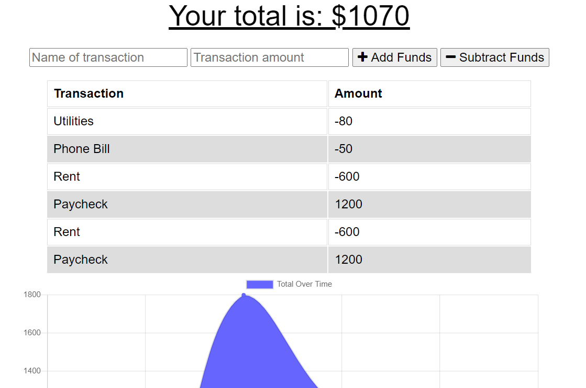
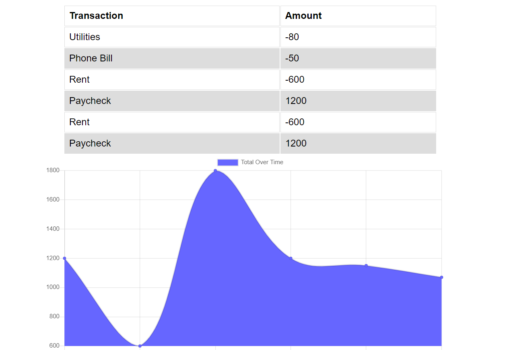

# Progressive Budget App

## Deployed Site

https://morning-woodland-98745.herokuapp.com/

## Description

A budget tracking web application that utilizes Progressive Web Application frameworks to store and track financial transactions.

## Screenshots

## Table of Contents

- [Installation](#installation)
- [Usage](#usage)
- [Licensing](#licensing)
- [Contributors](#contributors)

## Installation

User can visit the deployed application at https://morning-woodland-98745.herokuapp.com/. No additional installation is required.

## Usage

To run application locally, enter [node server.js] in the command line.

## Licensing

License: MIT License
https://opensource.org/licenses/MIT

## Contributors

https://github.com/ARBarber0510
